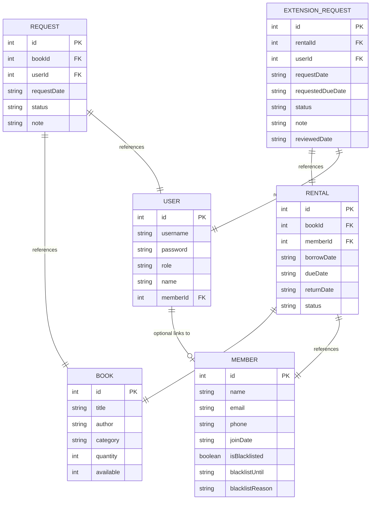

# Database Schema Documentation

This application uses a JSON-based database located at `be/data/database.json`. The data is structured as a collection of arrays representing "tables".

---

## Entity Relationship Diagram

---

## Tables Detail

### 1. Books (`books`)

Stores information about the library inventory.

- `id`: Unique identifier (Primary Key).
- `title`: Title of the book.
- `author`: Author of the book.
- `category`: Genre or category.
- `quantity`: Total copies owned.
- `available`: Copies currently on the shelf.

### 2. Members (`members`)

Stores personal information of readers.

- `id`: Unique identifier (Primary Key).
- `name`: Full name.
- `email`: Contact email.
- `phone`: Contact phone number.
- `joinDate`: Date joined (YYYY-MM-DD).
- `isBlacklisted`: Boolean flag for suspension.
- `blacklistUntil`: Date until which member is blocked.
- `blacklistReason`: Why the member was blocked.

### 3. Users (`users`)

System accounts for Authentication.

- `id`: Unique identifier (Primary Key).
- `username`: Login name.
- `password`: Hashed password (Bcrypt).
- `role`: 'admin' or 'user'.
- `name`: Display name.
- `memberId`: Linked member ID (for 'user' role).

### 4. Rentals (`rentals`)

Tracks book borrowing transactions.

- `id`: Unique identifier (Primary Key).
- `bookId`: Foreign Key linking to `books`.
- `memberId`: Foreign Key linking to `members`.
- `borrowDate`: Date borrowed.
- `dueDate`: Date due for return.
- `returnDate`: Actual date returned (null if active).
- `status`: 'borrowed' or 'returned'.

### 5. Borrow Requests (`requests`)

Users requesting to borrow books.

- `id`: Unique identifier (Primary Key).
- `bookId`: Foreign Key linking to `books`.
- `userId`: Foreign Key linking to `users`.
- `requestDate`: Date request was made.
- `status`: 'pending', 'approved', or 'rejected'.
- `note`: User's message or reason.

### 6. Extension Requests (`extensionRequests`)

Users asking for more time on a rental.

- `id`: Unique identifier (Primary Key).
- `rentalId`: Foreign Key linking to `rentals`.
- `userId`: Foreign Key linking to `users`.
- `requestDate`: Date request was made.
- `requestedDueDate`: Target new due date.
- `status`: 'pending', 'approved', or 'rejected'.
- `note`: User's reason for extension.
- `reviewedDate`: When the admin processed the request.
